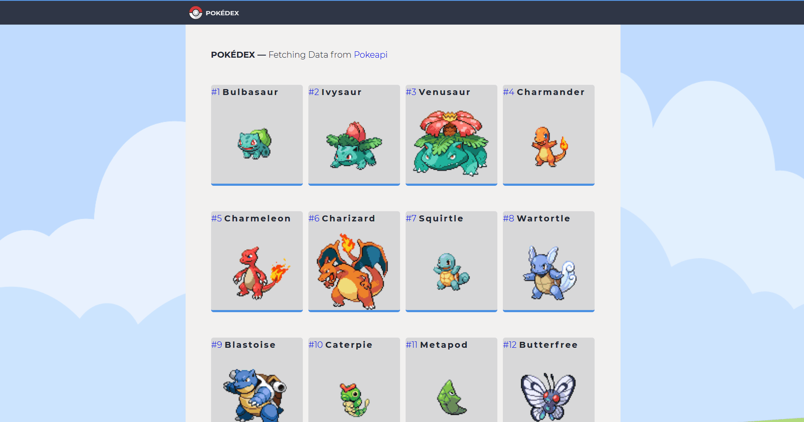

# pokemon-encyclopedia

React App to fetch pokémons details from pokeapi.co - **Live Demo Link** https://pokemonencyclopedia.netlify.app/

### Rationale for building the app:

I was interested in fetching data from a complex API and displaying a details page.

### List of App's Functionality:

- Fetch data from external API
- Pagination with react-query
- Details page
- React Hooks

### Instructions for Deploying the App Locally:

- Clone or download the repo
- Open in a text editor the folder
- npm install on terminal
- npm start
- made with create-react-app
